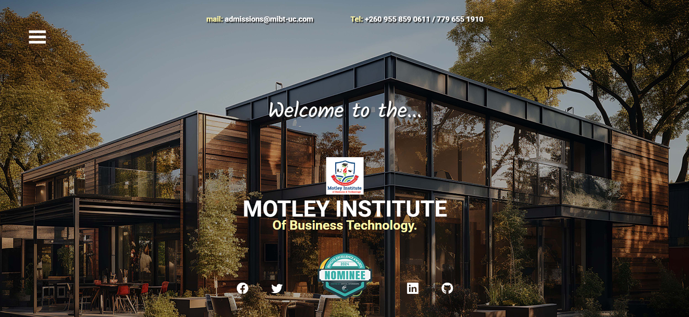

# MIBT-Landing-Page
_Main landing page linking microsites_

## Overview
Upon the request of one of my clients, MIBT Landing Page was built from the ground up to link their various microsites. Created with HTML, CSS, and JScript.

## Purpose
Key expectations are to be the face of the institution. Create an attractive, functional digital space where their members can interact, access resources and contact various departments. A space that grabs attention, engages the user and is easy to navigate. Web pages contained in this build are there only to serve as place holders and are not linked to this project nor are they products of Rodev-Apps.

## Mock-up

## Website Link
Click [**here.**](https://rodev-apps.github.io/MIBT-Landing-Page/) to visit site.

## Feedback
Should you require further information, please check my social media links and/or feel free to reach out if you have any questions, queries, or suggestions. Thanks for stopping by.

_Rodevs EC100225_      

